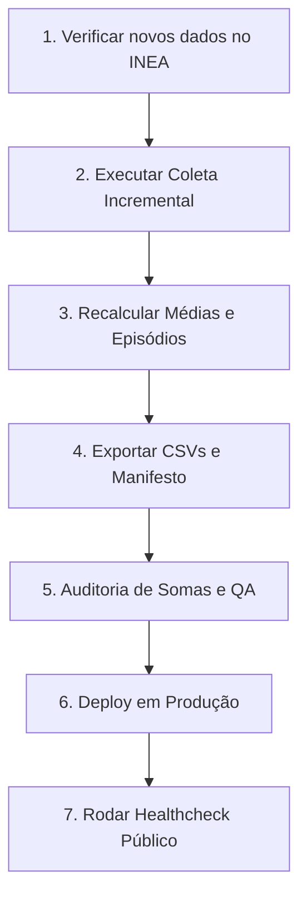

# Checklist Operacional — Atualização Mensal do Observatório do Ar

Este guia operacional descreve os passos sistemáticos para realizar a atualização incremental mensal dos dados de qualidade do ar (PM10 e PM2.5) coletados do WebLakes/INEA, assegurando a integridade estatística, validação regulatória e publicação em produção.

---

## Fluxo Geral de Trabalho



---

## Checklist Mensal de Manutenção

### [ ] 1. Verificar Publicação de Novos Dados no INEA
*   **Ação:** Verificar no portal oficial do INEA se há novos dados horários disponíveis para Volta Redonda ou rodar o script de descoberta.
*   **Comando:**
    ```bash
    npm run inea:discover
    ```

### [ ] 2. Executar Coleta Incremental do WebLakes
*   **Ação:** Baixar os dados brutos horários do mês mais recente para PM10 e PM2.5 de todas as estações.
*   **Comandos:**
    ```bash
    # Coleta de PM10 e PM2.5 incremental
    npx tsx scripts/inea-weblakes-pm25-collect-stations.ts
    ```

### [ ] 3. Recalcular Médias e Episódios de Atenção
*   **Ação:** Atualizar os consolidados de banco de dados locais e recalcular a série mensal de excedências acumuladas OMS e CONAMA 506.
*   **Comandos:**
    ```bash
    # Executar script de geração de episódios de atenção
    npx tsx scripts/generate-attention-episodes.ts
    ```

### [ ] 4. Atualizar Arquivos CSV e o Manifesto de Dados
*   **Ação:** Executar a geração de planilhas de download público sob `public/data/air/` e recalcular o arquivo de manifesto com o novo hash de commit e metadados de versão do dataset.
*   **Comando:**
    ```bash
    npx tsx scripts/generate-csv-exports.ts
    ```

### [ ] 5. Rodar Auditoria de Somas e Consistência (QA Técnico)
*   **Ação:** Certificar que as ultrapassagens mensais somam exatamente o acumulado anual.
*   **Comando:**
    ```bash
    # Executa auditoria contratual e de consistência cruzada
    npx tsx scripts/inea-weblakes-contract-audit.ts
    ```

### [ ] 6. Rodar QA de Linguagem Editorial
*   **Ação:** Garantir que nenhuma expressão restrita de monitoramento instantâneo (ex: leitura dinâmica não escapada) foi introduzida nas páginas e relatórios públicos.
*   **Comando:**
    ```bash
    npm run inea:qa:language
    ```

### [ ] 7. Executar Build e Testes Unitários de Verificação (Verify)
*   **Ação:** Compilar a aplicação localmente e passar pelos linters de TypeScript e ESLint.
*   **Comando:**
    ```bash
    npm run verify
    ```

### [ ] 8. Realizar o Deploy da Nova Versão na Vercel
*   **Ação:** Publicar as alterações de código e de datasets em produção.
*   **Comando:**
    ```bash
    npx vercel --prod
    ```

### [ ] 9. Executar o Smoke Test / Healthcheck Público em Produção
*   **Ação:** Executar o script de healthcheck apontando para o host de produção para validar rotas, CSVs e integridade de APIs Supabase.
*   **Comando:**
    ```bash
    # Valida o ambiente de produção real
    npx tsx scripts/observatorio-healthcheck.ts
    ```

---

## Gestão de Erros Comuns e Salvaguardas

1.  **Erro Supabase HTTP 500 (Conexão com Banco):**
    *   *Sintoma:* APIs falhando em produção, mas funcionando localmente.
    *   *Solução:* Sincronizar as chaves de ambiente executando o script de sincronização Vercel `sync_env_vercel.js` ou adicionando-as manualmente no dashboard da Vercel.
2.  **Valores Nulos nos Gráficos:**
    *   *Sintoma:* Gráficos ou matrizes com áreas em branco.
    *   *Solução:* Verificar no relatório do healthcheck se os CSVs foram baixados por completo e se o `rows_count` no `manifest.json` condiz com o tamanho físico real das tabelas.
3.  **Lembrete Editorial Crucial:**
    *   Sempre que reportar dados, preserve a frase obrigatória:
        > *"Dado horário público WebLakes — comparação experimental — sem QA/QC oficial explícito. Ausência de dado não representa ar bom."*
