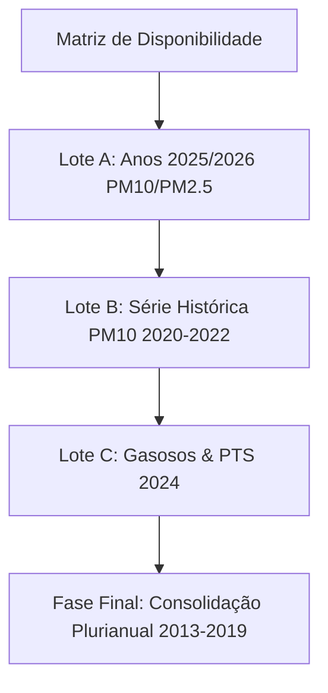

# Estado da Nação — Roteiro de Expansão Histórica de Anos e Parâmetros

Este documento estabelece a estratégia técnica e operacional para a expansão histórica dos dados de qualidade do ar no Observatório do Ar, com base nas descobertas da Matriz de Disponibilidade obtida via varredura amostral da plataforma INEA/WebLakes.

---

## 1. Contexto e Objetivos

O Observatório do Ar atualmente conta com uma base consolidada de dados de PM10 e PM2.5 para os anos de 2022–2024. A verificação da disponibilidade histórica em 14 anos (2013–2026) revelou oportunidades concretas para estender a linha do tempo e incorporar novos parâmetros (SO2, NO2, O3, CO e PTS), mas também apontou severas limitações físicas dos sensores governamentais.

O objetivo deste plano é delinear uma expansão estruturada em três lotes (A, B e C), mitigando riscos técnicos e respeitando os limites éticos de consulta ao servidor público.

---

## 2. Riscos Técnicos e Mitigações

### 2.1 Sobrecarga do Servidor Governamental (INEA/WebLakes)
*   **Risco:** O volume de requisições necessárias para extrair 14 anos de dados horários em 4 estações e 7 parâmetros pode acionar mecanismos de bloqueio de IP ou causar lentidão na plataforma pública.
*   **Mitigação:** 
    *   **Coleta Mensal Otimizada:** As requisições de expansão devem ser agrupadas em intervalos mensais (utilizando a capacidade do JqGrid de trazer até 1500 linhas em uma única chamada), reduzindo o número total de conexões em 96.7%.
    *   **Pausas de Cortesia (Politeness Delay):** Configurar um intervalo randômico de 3 a 5 segundos entre as chamadas no script de importação.
    *   **Mecanismo de Cache Ativo:** Persistir arquivos raw em disco na pasta `.cache/inea/weblakes/raw/` para evitar re-Scraping de dados já processados.

### 2.2 Desperdício em Consultas de Sensores Inoperantes
*   **Risco:** Gastar tempo de conexão e chamadas HTTP consultando poluentes em estações que nunca mediram tais parâmetros ou que estão inativas há anos.
*   **Mitigação:**
    *   **Estação 72 (Meteorológica):** Deve ser completamente excluída dos scripts de importação de poluentes de qualidade do ar, uma vez que a matriz comprovou 100% de dados vazios (`EMPTY`) para poluentes.
    *   **PM2.5 pré-2021:** O script deve ignorar consultas de PM2.5 para qualquer ano entre 2013 e 2020 em todas as estações, dado que a matriz provou que o parâmetro não existia fisicamente na rede de Volta Redonda nesse período.
    *   **Gargalo do O3 (Belmonte e Retiro):** Ignorar chamadas de Ozônio na estação Belmonte (para 2019-2024) e Retiro (para 2017-2021 e 2023-2024), direcionando a coleta apenas para Santa Cecília.

### 2.3 Unidades e Métricas Especiais
*   **Monóxido de Carbono (CO):** A plataforma WebLakes armazena leituras de CO em `ppm`. A comparação regulamentar e de saúde deve ser feita em `mg/m³`. O script de ingestão e normalização deve obrigatoriamente converter os valores utilizando o fator `1 ppm = 1.145 mg/m³` (em condições normais de 25°C e 1 atm), conforme implementado em `derivedMetrics.ts`.
*   **Média Móvel de 8 Horas:** CO e O3 possuem thresholds baseados em janelas móveis de 8 horas. Os algoritmos de agregação devem aplicar a função genérica `computeMoving8h` em vez de médias diárias simples de 24 horas.

---

## 3. Roteiro de Expansão Recomendado

A expansão do portal deve ser realizada em fases incrementais e controladas:

### 3.1 Lote A — Expansão Recente (2025 & 2026)
*   **Foco:** PM10 e PM2.5.
*   **Estações:** Belmonte (69), Retiro (70), Santa Cecília (71).
*   **Objetivo:** Completar o panorama de dados recentes para o ano anterior (2025) e o ano corrente (2026).
*   **Justificativa:** É a faixa com maior densidade de dados e interesse público imediato para o acompanhamento da qualidade do ar contemporânea.

### 3.2 Lote B — Fechamento da Série de Particulados (2020–2022)
*   **Foco:** PM10 (e PM2.5 para 2021–2022).
*   **Estações:** Belmonte (69), Retiro (70), Santa Cecília (71).
*   **Objetivo:** Estender a série plurianual de material particulado para trás, criando uma linha do tempo de 7 anos contínuos (2020–2026).
*   **Justificativa:** Permite uma visualização robusta da tendência histórica de poeira e particulados grossos antes da consolidação do portal.

### 3.3 Lote C — Homologação de Novos Poluentes (2024)
*   **Foco:** SO2, NO2, O3, CO e PTS.
*   **Estações:** Belmonte (69), Retiro (70), Santa Cecília (71).
*   **Objetivo:** Importar os parâmetros gasosos e as Partículas Totais em Suspensão (PTS) referentes ao ano de 2024 completo.
*   **Justificativa:** Funciona como um laboratório de validação cruzada para homologar a renderização dos novos poluentes na interface pública do portal antes de estender suas coletas para outros anos.

---

## 4. Diretrizes Editoriais e de Comunicação Pública

### 4.1 Proibição de Linguagem em Tempo Real
Em conformidade com a governança do projeto, é estritamente proibido o uso de termos que sugiram monitoramento instantâneo, dinâmico ou em tempo real (como "ar agora", "tempo real", "live", "atualizado minuto a minuto").

*   **Terminologia Correta:** "Dados amostrais históricos periódicos compilados em lote", "relatórios consolidados periódicos", "histórico de monitoramento oficial".
*   **Aplicação no UI:** Todas as legendas explicativas sobre a matriz e os dados históricos devem reforçar que as leituras são fruto de compilações periódicas off-line extraídas dos relatórios públicos governamentais.

### 4.2 Disclaimer da Matriz de Disponibilidade
O portal deve manter o seguinte aviso regulamentar de forma visível na seção correspondente:
> "Esta matriz reflete a disponibilidade de registros horários amostrais identificada na plataforma pública oficial. Ela serve para fins de auditoria metodológica e transparência, não substituindo ou alterando as publicações consolidadas do órgão regulador estadual."
