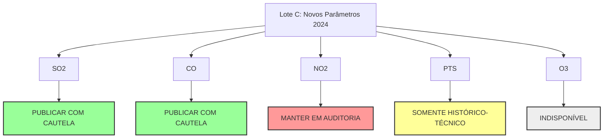

# Estado da Nação — Relatório Final de QA do Lote C (2024)

**Data do Relatório:** 2026-05-31  
**Fase:** Homologação do Lote C (Novos Parâmetros 2024)  
**Estações:** Belmonte, Retiro e Santa Cecília  
**Status Geral de Homologação:** **APROVADO COM RESTRIÇÕES DE SEGURANÇA E BLOQUEIOS PARCIAIS**

---

## 1. Veredito e Respostas aos Questionamentos Críticos

Esta auditoria final consolida as decisões tomadas após a análise analítica e o saneamento das séries de novos parâmetros (SO₂, NO₂, CO, PTS e O₃) recolhidas para o ano de 2024.

### 1.1. Dióxido de Enxofre (SO₂) pode publicar?
*   **Veredito:** **SIM, PUBLICÁVEL COM CAUTELA**.
*   **Justificativa:** Os sensores apresentaram comportamento estável e contínuo, cobertura superior a 75% em todas as três estações automáticas de Volta Redonda, e zero (0) ultrapassagens confirmadas em relação tanto ao padrão nacional diário (20 µg/m³) quanto à diretriz da OMS (40 µg/m³). A qualidade de dados brutos está adequada para divulgação com nota técnica.

### 1.2. Monóxido de Carbono (CO) pode publicar?
*   **Veredito:** **SIM, PUBLICÁVEL COM CAUTELA**.
*   **Justificativa:** A validação metodológica confirmou o uso correto do fator de conversão física (1.145) exclusivo para a comparação com a OMS (threshold diário de 4 mg/m³) e o uso da unidade nativa (ppm) para a régua móvel de 8h da CONAMA (threshold de 9 ppm, com mínimo de 6/8h válidas por janela). A cobertura anual foi excelente (>96%) e confirmaram-se zero (0) ultrapassagens nas três estações.

### 1.3. Dióxido de Nitrogênio (NO₂) fica em auditoria?
*   **Veredito:** **SIM, BLOQUEADO / MANTER EM AUDITORIA**.
*   **Justificativa:** A auditoria na estação VR-Retiro detectou uma provável anomalia sistemática de linha de base (zero drift / baseline offset) de aproximadamente +20 µg/m³ que elevou artificialmente todas as médias diárias do ano, resultando em um indicador falso-positivo de 100% de excedência da diretriz da OMS (366 dias). Para evitar alarmismo injustificado baseado em desvio de calibração instrumental, a publicação desta camada está suspensa.

### 1.4. Partículas Totais em Suspensão (PTS) fica como histórico-técnico?
*   **Veredito:** **SIM, BLOQUEADO / APENAS HISTÓRICO-TÉCNICO EM AUDITORIA**.
*   **Justificativa:** Identificou-se uma grave anomalia na série de Retiro PTS (média anual bruta de 445,165 µg/m³ e 366 dias de excedências diárias). A análise revelou que os dados apresentam flutuação normal mas estão deslocados por um provável erro de fator de escala (multiplicador de 10) ou descalibrados de ganho na fonte. O parâmetro servirá apenas para depuração técnica e auditorias cruzadas, sem publicação de alertas ou divulgação cidadã ampla.

### 1.5. Ozônio (O₃) fica indisponível?
*   **Veredito:** **SIM, BLOQUEADO / INDISPONÍVEL**.
*   **Justificativa:** As consultas incrementais retornaram 0h de dados coletados em todas as estações durante todo o ano de 2024, indicando inatividade completa da rede local de sensores deste parâmetro. Ficará desabilitada na interface com a devida nota explicativa ("ausência de dados não representa ar de boa qualidade").

---

## 2. Estratégia de Liberação no Próximo Pacote Público

### 2.1. Parâmetros que entram no próximo pacote experimental público:
*   **SO₂ (Dióxido de Enxofre):** Disponibilizado com aviso de homologação experimental na seção "Novos parâmetros em auditoria" na interface e como arquivo de preview CSV.
*   **CO (Monóxido de Carbono):** Disponibilizado com aviso de homologação experimental de unidade e janela móvel.

### 2.2. Parâmetros que ficam bloqueados na camada pública principal:
*   **NO₂ (Dióxido de Nitrogênio):** Bloqueado. Exibido na interface apenas como "Em auditoria crítica".
*   **PTS (Partículas Totais em Suspensão):** Bloqueado. Exibido na interface apenas como "Somente histórico-técnico em auditoria".
*   **O₃ (Ozônio):** Bloqueado. Exibido na interface como "Indisponível em 2024".

---

## 3. Segurança do Repositório e Versionamento
Em conformidade com a **Tarefa 8**, os arquivos normalizados e consolidados finais dos novos parâmetros **não** foram adicionados ao arquivo manifest público (`manifest.json` do open data v1.3.x). OsPreviews de dados estruturados foram salvos isoladamente como planilhas CSV na pasta restrita `reports/open-data-preview/` para escrutínio acadêmico. Nenhum novo parâmetro está liberado no mapa de episódios principal.
